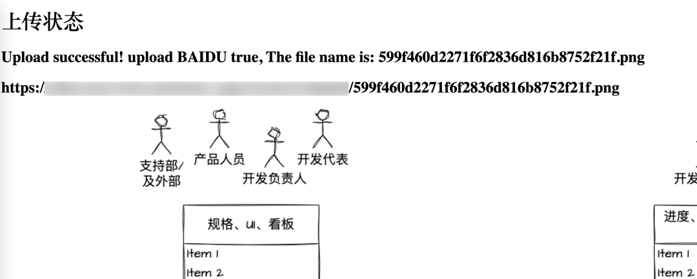

这是一个建站之图片服务程序

# 1 为什么有这个？
个人服务器，低配高速，高速指的是带宽，走的流量计费，所以需要把配图部署在其它地方。

# 2 定位
- 要能打开网页就能传图，这样比较方便；
- 传完图后，即返回公网完整url；
- 考虑历史建站时，图片资料因服务器过期而丢失的情况，传图的同时备份到百度网盘。

# 3 功能点
- 支持多类型文件
- 上传到minio，并开放公网访问，服务器172.16.0.142(已迁移)/data/docker-compose/minio/data/daniel目录下
- 完成对百度网盘的对接，上传到个人网盘的"我的应用数据/roadl"目录下

# 4 技术特点
- token等用cache管理的，但是用的是hutool简易管理方式
- http请求用的java原生api，但支持传request body，以及上传文件

# 5 quick start
编译：mvn clean package -DskipTests

创建image：docker build --tag=file-manager:latest .

运行，注意修改目录映射：docker container run -p 8080:8080 -v c:/Users/sito/Documents:/Users/Daniel/Documents/  file-manager:latest
 
访问网页A，可上传图片：localhost:8080/daniel/upload

再百度授权，复制授权码，作为参数code回调本地服务：http://localhost:8080/daniel/bd/callback?code=70411a753b8009fbcaeff10fa35d8d79

则拿到了access token并缓存下来了。

这时刷新网面A，则标识为已授权。

最终，可上传图片了，并返回了上传结果：


> 本服务可以本地运行，即具备了上传和管理私人图片的功能。也可以将该服务部署到远程。

# run with docker-compose
将下列文件拷贝到目标服务器下：

```text
- docker-compose.yml
- build
  - file-manager-1.0.0.jar
  - Dockerfile
```

运行命令，安装并后台运行：`docker-compose -d up`

可看到日志：
```shell script
[root@localhost daniel-roadl]# docker-compose up -d
[+] Running 0/1
 ⠿ file-manager Warning                                                                                    4.7s
[+] Building 6.8s (12/12) FINISHED                                                                              
 => [internal] load build definition from Dockerfile                                                       0.3s
 => => transferring dockerfile: 625B                                                                       0.0s
 => [internal] load .dockerignore                                                                          0.2s
 => => transferring context: 2B                                                                            0.0s
 => [internal] load metadata for docker.io/adoptopenjdk/openjdk11:jdk-11.0.11_9-ubuntu-slim                2.5s
 => [internal] load build context                                                                          0.2s
 => => transferring context: 27.35MB                                                                       0.1s
 => CACHED [stage-1 1/5] FROM docker.io/adoptopenjdk/openjdk11:jdk-11.0.11_9-ubuntu-slim@sha256:2eaffea13  0.0s
 => [builder 2/3] COPY *.jar application.jar                                                               0.3s
 => [builder 3/3] RUN java -Djarmode=layertools -jar application.jar extract                               1.8s
 => [stage-1 2/5] COPY --from=builder dependencies/ ./                                                     0.2s
 => [stage-1 3/5] COPY --from=builder spring-boot-loader/ ./                                               0.1s
 => [stage-1 4/5] COPY --from=builder snapshot-dependencies/ ./                                            0.0s
 => [stage-1 5/5] COPY --from=builder application/ ./                                                      0.1s
 => exporting to image                                                                                     0.5s
 => => exporting layers                                                                                    0.4s
 => => writing image sha256:9384f8ace43fa0113370e8d3f19f554f7fd1de7a9107e4a849a88fba0ea0bcdd               0.0s
 => => naming to docker.io/library/file-manager:1.0.0                                                      0.1s
[+] Running 2/2
 ⠿ Network daniel-roadl_default  Created                                                                   0.3s
 ⠿ Container roadl-file-manager  Started                                                                   0.7s
```

其它docker-compose实用命令：
- docker-compose restart image # 重启容器
- docker-compose logs -f image # 实时查看日志
- docker exec -it nginx-web nginx -s reload # 进入到nginx容器，并加载外部配置的修改

更多命令，可参考[这里](https://www.cnblogs.com/wtzbk/p/15125977.html)